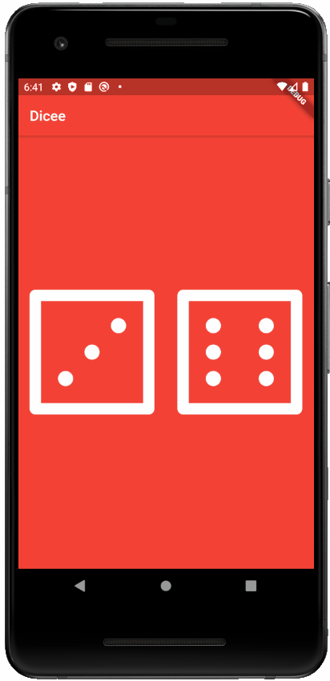

# Dicee

This is a Flutter app I worked on following the starter code from the [Flutter Udemy course by Angela Yu](https://www.udemy.com/course/flutter-bootcamp-with-dart/).

This app rolls two dices. Crossing my fingers, and hoping the numbers adds up to ten. A ten will get me on the longest ladder on the Snake and Ladders board.

If I get a ten, then I can tell Jeff, "Eat my dust, Jeff. I'm going to win soon." I can follow that up with a evil victory laugh.
I hate Jeff and want to defeat him so bad.

## Skills Learned

* Stateless and Stateful Widgets
* "Flexible" Widget
* Dart is a statically typed language.
  * But it can be made dynamic by using the variable type, "dynamic."
* Anonymous Functions
* dart:math library for Random().nextInt()
* onPressed attribute on Buttons

## Screenshot

